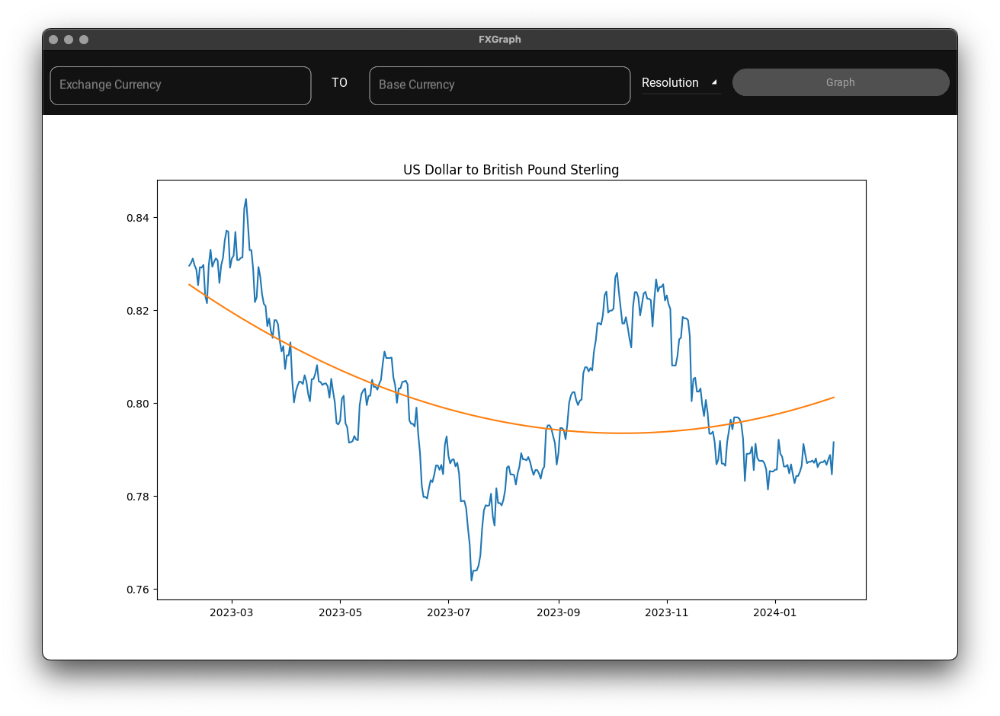

# FXGraph

## This is a project that I completed for the next-level-python online course at [title](https://www.arjancodes.com)

### To run you need to get a API key from [title](https://fxratesapi.com) and place in .env file libs with the key APIKEY

